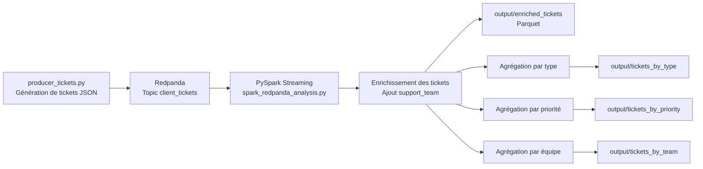

# POC - Pipeline Temps Réel avec Redpanda & PySpark

##  Contexte

Dans le cadre de la modernisation de l’infrastructure data, ce projet simule un pipeline de traitement de données en temps réel basé sur :

- Redpanda (streaming)
- PySpark (traitement)
- Stockage en fichiers (output)

L’objectif est de démontrer la capacité à :
- ingérer des données en continu
- les transformer
- produire des analyses exploitables

---

## 📂 Structure du projet

Tous les fichiers du projet sont regroupés dans un même dossier :

```text
redpanda_project_dockerized/
├── .dockerignore
├── create_topic.sh
├── docker-compose.yml
├── Dockerfile.producer
├── Dockerfile.redpanda
├── Dockerfile.spark
├── producer_tickets.py
├── README.md
├── requirements_producer.txt
├── run_spark.sh
├── spark_redpanda_analysis.py
├── wait_for_redpanda.sh
├── output/             # généré à l’exécution
└── checkpoints/        # généré à l’exécution

---

## Partie lancement corrigée

```markdown
## ▶️ Exécution du projet

### 1. Démarrer les services

Depuis le dossier `redpanda_project_dockerized`, lancer :

```bash
docker compose up --build

---

## Partie résultats attendus plus juste

```markdown
## 📊 Résultats produits

Le pipeline génère deux types de sorties :

### 1. Données enrichies
Les tickets enrichis sont enregistrés en **Parquet** dans :

- `output/enriched_tickets`

Chaque ticket contient notamment :
- `ticket_id`
- `client_id`
- `created_at`
- `request`
- `request_type`
- `priority`
- `support_team`

### 2. Agrégats par batch
Des statistiques sont générées en **JSON** dans :

- `output/tickets_by_type`
- `output/tickets_by_priority`
- `output/tickets_by_team`

Chaque batch est stocké dans un sous-dossier du type :

```text
batch_0/
batch_1/
batch_2/
...

```

## 🏗️ Architecture du pipeline


